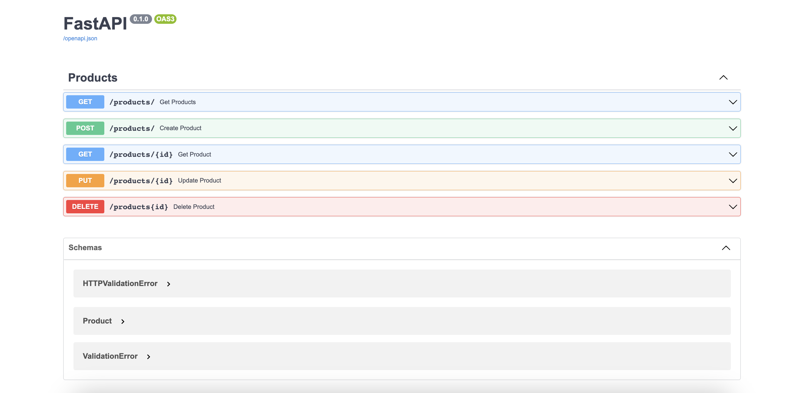

### 🐍⚛️ An Ecommerce
with Python and React.



### 🧡 Introduction
This project is an ecommerce made with Python, React and MongoDB. It's a complete online store for technology. It has different views for interact with the products and making transactions. It provides an <b>OAuth2</b> system for authentication, and offers ways to managing the information.

The project is a full responsive site, and implements all mainly functionalities of a real world application. I made all designs inspired in differents sites like Behance and Pinterest. In each corresponding folder (`fronted`, `backend`) are the implementation details, the project structures, installation and commands.


### ⚡️ Backend
- FastAPI
- Motor Driver
- MongoDB


### 🎨 Frontend
- React.js
- Tailwind
- React Query v4
- Redux / Redux Toolkit


### 💾 Database
A database it's available with Docker if you don't want to install it. For use it, just create a `.env` file in the root directory, and fill the following fields:
```
MONGO_USERNAME=
MONGO_PASSWORD=
```
After up the container:
```
# Mac
docker compose up -d

# Linux
docker-compose up -d
```

The database it's running by default on `27017` port. But you can change it if you want. Also, express-mongo is included as support tool.


### 📄 License
MIT